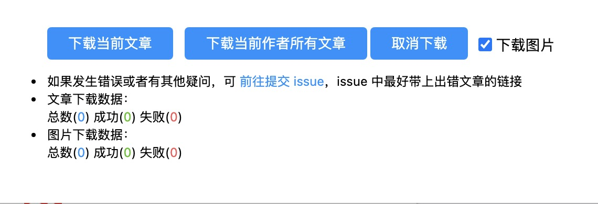

## ArtDD

一键下载 **掘金、CSDN、开源中国、博客园文章** 文章的 `Chrome` 插件

## Usage

需要在掘金/CSDN/开源中国/博客园 **文章的详情页面** 使用（只有这样，按照目前的逻辑，插件才有可能进行定位，否则咋知道你要下载啥），即页面链接格式为以下几种格式：

- `https://juejin.cn/post/:postId`
- `https://blog.csdn.net/:user/article/details/:postId`
- `https://my.oschina.net/:user/blog/:postId`
- `https://my.oschina.net/u/:user/blog/:postId`
- `https://www.cnblogs.com/:user/p/:postId.html`

>`:user` 和 `:postId` 是占位符

插件会根据当前页面链接自动分辨出文章所属平台，可能有些文章详情链接是不支持的，例如博客园存在很多个版本的文章详情页链接格式，想要支持所有的链接是不太可能的，如果发现 *下载当前文章* 和 *下载当前作者所有文章* 这两个按钮是灰色的点不了，那么就是你当前页面链接不对，请自行检查

## 功能

|功能|描述|
|---|---|
|下载当前文章|会下载当前文章详情页的文章数据|
|下载当前作者所有文章|会下载当前文章所属作者名下的所有文章|
|取消下载|考虑到有的作者文章很多，图片很多，导致较长时间无法下载完毕或者占用太多资源卡死浏览器，所以提供了一个暂停下载的功能 暂停下载只会暂停未开始的下载，已经在浏览器下载队列中的下载任务不会暂停|
|下载图片|如果你并不想把文章中的超链接图片下载到本地，那么取消勾选即可，默认是下载文章中的所有超链接图片|

## Q&A

- 图片下载报错了怎么办

图片下载失败的原因有很多，例如图片链接失效、图片有访问权限、图片源网站速度太慢等，某一下载失败的图片不会影响到图片所在文章以及其他图片的下载
